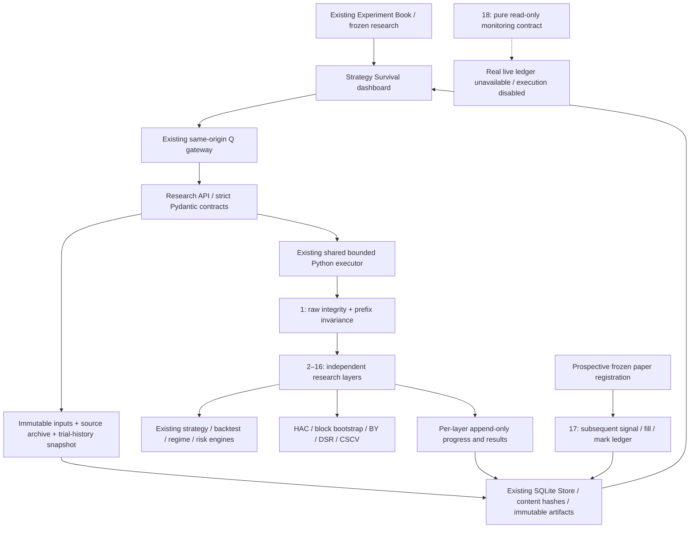

# Q Strategy Survival Pipeline

Implemented September 2026. This is a research evidence pipeline, **not an institutional certification, proprietary score, investment recommendation, or live-execution approval**. Existing Q features, Validation panels, experiment records, providers, gateway authentication, shared worker, Sites hosting configuration and deployment restrictions are retained.

## Repository map and implementation plan

The implementation extends these inspected modules:

| Existing component | Reuse / extension |
|---|---|
| `apps/engine/research/workspace.py`, `research/pipeline.py` | Frozen `ResearchRequest`, strategy catalogue, causal strategy/risk/allocator pipeline, source snapshots. |
| `backtesting/engine.py`, `backtesting/walk_forward.py` | Existing portfolio accounting and chronological validator, unchanged. |
| `data/validation.py`, `data/models.py` | Market-data quality diagnostics and OHLCV bundles; new raw hard checks precede any calculation. |
| `research/robustness.py`, `analytics/cost_sensitivity.py` | Existing research views remain. Survival recomputes using the same strategy/backtest constructors with development-only perturbations and stressed borrow. |
| `regime_detection/*`, `qresearch/regimes.py` | Existing causal rule classifications reused; adapter for provenance-qualified filtered HMM labels. No full-history HMM smoothing. |
| `analytics/*`, `portfolio/*`, `risk/*` | Existing research evidence preserved; independent HAC/bootstrap/CSCV and counterfactual portfolio diagnostics added. |
| `execution/simulator.py`, `qresearch/equity_account.py` | Existing fill-pricing primitive reused. The existing whole-share engine lacks volume caps; a separate bounded long-only stress account composes those fills with cash and volume constraints. |
| `evidence/storage.py` | Existing content-addressed SQLite artifacts and append-only events, including immutability triggers. |
| `apps/research_api.py`, `flagship_api.py` | Existing bounded shared executor, authentication and API routes; Survival routes added to research router. |
| `apps/gateway/engine.mjs` | Existing `/api/research` proxy works unchanged; no new credentials or order routes. |
| `components/flagship/research-workspace.tsx` | Additional Strategy Survival tab and Experiment Book outcome links. Existing views and decision workflow retained. |
| `lib/paper.ts` and existing deployment pages | Retained. New prospective ledger is explicitly separate from historical/manual account simulation and does not enable execution. |

Work proceeded through contracts/statistical functions, immutable service/persistence, APIs, dashboard, deterministic tests, and regression/build checks. New code is under `apps/engine/research/survival/`; the dashboard is `apps/web/components/flagship/survival-dashboard.tsx`.

## Meaning of states and gates

- **PASS:** calculation supported, no applicable configured gate was breached. Does not imply profitable investment or complete coverage.
- **WARN:** methodological limitation, diagnostic concern, or a configured warning. Review reasons and subdiagnostics.
- **FAIL:** hard integrity failure, calculation failure, or a configured failure gate. Hard failures cannot be downgraded by configuration.
- **N-A:** missing/invalid statistical prerequisites, unsupported data/account type, blocked dependency, or deliberately unrequested layer. Always carries a reason. It is not a pass.

The summary is a count of states plus hard failures and unresolved required layers. No weighted score is computed. `research_gates_satisfied` means no FAIL and no required N-A/unavailable gate metric. WARN remains a review requirement. **It does not replace the existing mandate gates.** When Survival exists, the latest run must complete and satisfy its research gates before a new paper-candidate decision; existing legacy gates must also pass. Historical decisions are not rewritten.

`gates` contains `{layer, metric, operator, threshold, severity}`. Operators are `>=` and `<=`; metric paths may address nested intervals. An unavailable metric is unresolved, never coerced to zero. `required_layers` defaults to `[1]`. Layer 1 cannot be omitted. Example: `{ "layer": 2, "metric": "test_sharpe", "operator": ">=", "threshold": 0.5, "severity": "WARN" }` is an explicit research preference, **not an institutional standard**. A user can choose FAIL instead. All protocols and attempts remain in history.

Defaults: 60 observations for statistical interpretation, 60/20/20 temporal split after common warmup, 126 training / 63 test bars, expanding folds (at most 8), local lookback scales 0.8/1/1.2, 300 circular-bootstrap samples of length-10 blocks, seed 42, 95% confidence, HAC lag 5, 252 daily observations/year, 8 CSCV blocks, 1% participation, next-close execution, 2x slippage shock, 4 leave-one-out subsets, stale-price flag after 5 repeated bars, 35% gap flag, synthetic -10% asset gap, 20% candidate weight in peer comparisons. These are bounded local-development choices, freely configurable within documented computational/numerical limits. Gaps/staleness are warnings, not proof of bad data. Default DSR effective trial count is **unset**. No universal Sharpe, p-value, PBO, or risk pass threshold is installed.

## All 18 layers

| # / purpose | Inputs and implemented output | Interpretation / limitations / minimum |
|---|---|---|
| 1 Integrity & bias | Raw OHLCV, benchmark, pipeline; duplicates/order/alignment, missing/nonpositive/nonfinite prices, OHLC consistency, stale/outlier/adjustment flags; prefix reruns at temporal boundaries compare historical target weights. | Duplicate/misaligned/invalid prices or future-dependent targets hard-fail. Does not prove all code is causal. PIT membership/delistings and exchange/calendar/action ledgers unavailable: those subaudits N-A. Known historical train/test exposure is disclosed. |
| 2 Train / validation / true OOS | Disjoint train, validation and chronological-test intervals after common warmup; separate return, CAGR, Sharpe, volatility and drawdown. Prior position and signal context retained. | At least 2 observations each for descriptive metrics; minimum-sample flag shown. Archived experiment history has already been examined, so **true OOS is N-A**, never relabeled. This pipeline does not create an untouched historical holdout retroactively. |
| 3 Walk-forward | Existing validator; rolling or expanding train windows, complete disjoint forward tests; fold dates, train/test metrics, aggregate net results and Sharpe dispersion. | Fixed strategy rules are not fitted models. Rolling mode changes training diagnostic slices; rule indicators retain prior causal context. Tests stop before the final chronological test. Oldest folds retained under cap; unused bars disclosed. Warmup at least max(126, longest lookback+2). |
| 4 Parameter stability | Same portfolio pipeline rerun with one sleeve’s lookback changed at a time; local parameter table/ranges, min/max/range Sharpe, positive fraction, retained failures. | Development segments only. Sign-changing neighbors warn of sensitivity. This is a one-dimensional local surface per sleeve, not a joint exhaustive grid; only parameters exposed by this strategy catalogue are varied. At least 2 distinct valid candidates. |
| 5 Cost stress | 1x baseline, 2x and 3x commissions/slippage/half-spread/borrow; fixed targets and full history account context; additional bps break-even solved by bisection. | Break-even solves geometric net return zero, extra **per-side traded-notional** commission bps on top of baseline. Search bounded to 1,000 bps; no turnover => N-A, baseline loss => zero additional capacity. No nonlinear impact, tax, financing or borrow recalls. |
| 6 Liquidity & execution | Existing fill simulator composed with a next-close whole-share cash ledger; 20-bar trailing volume caps known before execution, configured delay/slippage shocks, clipped orders, fills, minimum cash, positions, indicative capital capacity. | Unlevered long-only accounts and complete nonnegative volume required. Sells fund buys; leftovers expire. Share targets fixed at signal time. Adjusted-price/volume units are approximate; capacity p10 uses planned participation, not an empirical impact curve. No short locate/settlement model. |
| 7 Bootstrap / Monte Carlo | Circular moving-block daily net-return resampling with deterministic NumPy seed; full distributions and percentile CIs for Sharpe, CAGR, return, drawdown, plus sampled loss fraction. | At least max(minimum, 3 blocks), nonzero variance. Assumes weakly dependent stationary returns; wraparound artificial. 100–5,000 replications. No unseen tails, parameter-selection correction, or forecast claim. |
| 8 Significance | Intercept-only OLS with Newey–West/Bartlett HAC covariance; daily mean, SE, z, two-sided CI and one-sided p for H0: mean <=0. | At least max(minimum, 2*lags+3) and positive long-run variance. Asymptotic normal inference under weak stationarity/finite moments. Zero cash hurdle. P is not probability of profitability. |
| 9 Multiple testing | Every local parameter attempt persisted; prior compatible recorded trials included; Benjamini–Yekutieli adjusted HAC p-values and counts of valid/unusable trials. | At least 2 valid tests. BY allows arbitrary dependence but needs individually valid p-values and a disclosed family. Unknown external/adaptive research cannot be repaired; always flagged exploratory. Failed trials stay in the registry even without usable p-values. |
| 10 DSR / PBO | Established DSR function and exact CSCV over aligned development-return candidate matrix. Reports each diagnostic independently and N-A reasons. | DSR requires documented effective independent trial count <= recorded trials, >=2 candidates, nonzero cross-trial Sharpe variance, IID-return assumption and minimum observations. CSCV needs 4–12 even contiguous blocks, >=2 nonidentical candidates and minimum observations per half. Small local grids are conditional evidence only. |
| 11 Regime survival | Lagged Q rule regimes, prior 126-bar benchmark trend bull/bear and lagged 21-bar volatility relative to its prior expanding median; state metrics, counts and absolute-return concentration. | Minimum observations per state; smaller states N-A. Conditional returns are noncontiguous diagnostics. `Context.filtered_regimes` accepts only train-only forward-filter provenance; current archived portfolio runs do not provide aligned HMM labels, so HMM subdiagnostic N-A. |
| 12 Benchmark/factor attribution | Benchmark net comparison; OLS coefficients/daily alpha, HAC coefficient intervals, alpha p, R², residual volatility. `FactorProvider` interface accepts exactly aligned realized factor returns and source metadata. | Minimum observations and >=10 per coefficient, full-rank design, finite returns. Default is benchmark-only, zero cash hurdle; no installed style-factor feed. Provider interface is implemented; HTTP factor import is not. Attribution factors never feed strategy signals. |
| 13 Cross-universe | Same strategy rerun on deterministic alphabetical leave-one-out subsets; universe/omission, metrics, failures and fraction positive. | At least 3 assets, development dates only, bounded subset count. Tests sensitivity to available constituents, not transfer to all assets/sectors or survivorship-free historical membership. |
| 14 Temporal stability | Calendar-year/rolling metrics, partial-year labels, rolling Sharpe dispersion, absolute annual-return concentration. | At least 2 observations for descriptive subperiods; rolling windows >=max(minimum,63), stride 21. Overlapping windows dependent. No prespecified structural-break model/date: break test N-A. |
| 15 Portfolio interaction | Standalone sleeve correlations, budget/covariance marginal risk, target overlap, leave-one-sleeve-out constrained reruns; optional selected existing-experiment portfolio mixes. | >=2 sleeves or aligned peer returns; peers require matching data mode/currency and sufficient nonconstant history. Counterfactuals reflect allocator changes. Standalone covariance contributions do not equal constrained account contributions. Peer mixes use daily fractional rebalancing without incremental transaction modeling. |
| 16 Tail stress | Empirical 95% loss VaR/ES, worst days, worst rolling 20 bars, drawdown spells/duration/recovery, synthetic gap on current executed net weight. | >=max(minimum,60), few tail samples. VaR/ES are signed losses and can be negative in all-positive samples. Gap is a scenario, not probability. Fractional engine has no closed-trade ledger, so worst closed trades N-A. |
| 17 Paper forward validation | Frozen registration tied to experiment/version, append-only timestamped signals then observations/fills; NAV returns, costs vs expectations, exposure breaches, regime changes. UI and API support registration/events. | User-recorded paper data, not authenticated broker data. Strictly later timestamps, no pre-registration backfill, fills after signal receipt. No automated paper scheduler. Performance inference suppressed below minimum. Historical simulations cannot populate this record. |
| 18 Live monitoring | Pure read-only `monitor()` contract computes drift, exposure breaches, recent return, decay alerts against explicitly supplied limits and regime changes; unit-tested with labeled fixtures. | **Live layer N-A.** No live ledger/feed, reconciliation, deployment approvals or broker execution introduced. Production ingestion and operational alert delivery remain planned. No simulated values displayed as live. |

## Statistical methodology

All return metrics use simple net daily returns, sample SD (ddof=1), zero cash return and explicit annualization. Drawdown includes starting NAV. Constant series have undefined Sharpe (null), not a fabricated zero. Missing/nonfinite returns are rejected, not forward-filled. Confidence bounds are exposed in saved metrics and expandable dashboard diagnostics.

**DSR:** compute daily SR and the expected maximum SR under multiple trials using the cross-trial sample variance, Euler constant and normal quantiles. The PSR normal statistic is `(SR - SR0)*sqrt(T-1)/sqrt(1 - skew*SR + (PearsonKurtosis-1)*SR²/4)`. The implementation uses nonannualized SR throughout. Effective independent trial count is a documented assumption, not inferred from three correlated parameter neighbors. Serial correlation invalidates the simple IID approximation; use the separate HAC/bootstrap evidence. See [Bailey & López de Prado, The Deflated Sharpe Ratio (2014)](https://www.davidhbailey.com/dhbpapers/deflated-sharpe.pdf).

**CSCV/PBO:** split the aligned candidate-return matrix into S equal contiguous blocks; drop and disclose at most S-1 trailing observations. Enumerate all combinations choosing S/2 in-sample blocks, select the maximum in-sample Sharpe candidate, rank its complementary-sample Sharpe, use relative rank `rank/(N+1)` and logit `log(w/(1-w))`. PBO is fraction of logits <=0. Stable column order resolves training ties; average ranks resolve test ties; tie counts reported. No binomial confidence interval is attached to dependent combinatorial partitions. CSCV is a retrospective search diagnostic, not chronological future validation. See [Bailey et al., The Probability of Backtest Overfitting](https://www.davidhbailey.com/dhbpapers/backtest-prob.pdf).

**HAC and factors:** statsmodels OLS with `cov_type="HAC"`, configurable Bartlett lag count and asymptotic normal inference. Mean-return p is one-sided; factor-alpha p is two-sided, clearly named. Alpha annualization is arithmetic `252*alpha_daily`, not CAGR. See [statsmodels robust covariance documentation](https://www.statsmodels.org/stable/generated/statsmodels.regression.linear_model.OLSResults.get_robustcov_results.html).

**Multiple testing:** `multipletests(method="fdr_by")` applies the Benjamini–Yekutieli harmonic correction, retaining arbitrary dependence between tests. It does not make invalid individual p-values valid or recover omitted trials. Families match dataset fingerprint, code, split fractions, annualization, confidence and HAC lags; exact return dates must also match. Equivalent candidate configurations are deduplicated for inference, while every attempted run remains in persistence. See [statsmodels multiple-testing implementation](https://github.com/statsmodels/statsmodels/blob/main/statsmodels/stats/multitest.py).

## Reproducibility, storage and APIs

Storage uses a sibling `survival/registry.sqlite` beneath the same configured flagship root. Immutable artifact kinds: `survival_run`, `survival_input`, `survival_source`, `survival_result`, `survival_trial`, `survival_paper`, `survival_paper_event`. Job lifecycle/progress are append-only events. Restarts mark interrupted work failed, preserving inputs and completed layers. Completed results are never overwritten. Failed experiments are never deleted or filtered out of the book.

At submission, verify the archived CSV fingerprint, capture exact raw CSV bytes, universe/range/strategy/costs, configuration/seed, original and executing source metadata, source ZIP, selected peers and frozen paper/trial evidence. The source archive includes execution and qresearch modules. A completed export includes inputs, source, result, all run events, local trials and every referenced prior trial. Provider errors never cause synthetic fallback. Retrieving real market data is unnecessary for a validation rerun.

The known Experiment Book attempt inventory (including failed jobs) is also frozen and its count exposed. Existing experiments without compatible recorded parameter-return paths are disclosed history, not silently converted to independent tests or added to a fabricated DSR trial distribution.

Deterministic cache key includes experiment/config/source/input/trial-context hashes. Identical completed or in-flight runs are reused. Failed jobs can be retried as new attempts. A newly available compatible trial or forward observation can invalidate the result cache. Different layer scopes also have distinct keys; dependencies such as parameter paths are computed even if their presentation layer is unrequested. No external worker platform or paid feed is required.

The current adapter accepts completed Portfolio Research experiments. Other retained trading-lab/custom-strategy engines remain functional but do not yet supply this adapter contract. Arbitrary custom Python is not imported into the service. Calling a layer with unsupported prerequisites yields N-A rather than borrowing unrelated data.

All routes share `/api/research/survival`, through Q's existing `/integrations/engine` proxy:

| Route | Contract |
|---|---|
| `GET /catalog` | 18 method descriptions, default config and strict JSON schema. |
| `POST /runs` | `{experiment_id, config, peer_experiment_ids: [], forward_record_id: null}`; HTTP 202, immutable run ID, cache flag. |
| `GET /runs?experiment_id=…` | All matching attempts/outcomes, including failures. |
| `GET /runs/{id}` | Job status, completed layer progress, full result when available. |
| `GET /runs/{id}/export` | Reproducibility ZIP, also available for failed/partial jobs. |
| `POST /paper` | `{experiment_id, initial_nav}` freezes a new forward registration at server UTC time. |
| `GET /paper?experiment_id=…` | Registrations, separate from historical research. |
| `GET /paper/{id}` | Immutable record, events and monitoring diagnostics. |
| `POST /paper/{id}/events` | Strict signal/observation schema; UTC and temporal checks; HTTP 201. |

`python -m research.survival.replay export.zip` validates content hashes, local engine source/dependency versions, reconstructs archived inputs and checks exact deterministic outputs. It never executes archive code. If local code changed, replay requires the exported source tree and recorded environment. BLAS/platform differences may prevent bitwise equality and are reported, not hidden.

User-recorded paper marks may be irregular or intraday. Their total return and drawdown are descriptive; annualized Sharpe/CAGR/volatility remain N-A until a verified cadence/calendar is supplied to the monitoring contract. Expected versus realized weight deviation and recorded fill counts are also reported. CSCV is bounded by `max_cscv_trials` (64 by default, up to 256); if exceeded, it returns N-A rather than selecting successful trials or silently sampling a favorable subset. A configured FAIL-severity gate with an unavailable metric remains unresolved even when its layer is not listed as required.

## Validation and remaining limits

`tests/test_survival.py` covers splits/disjoint full folds, seeded bootstrap reproducibility, independent DSR moments/formula, known CSCV rank reversal, BY values, known alpha/beta, drawdown baseline, hard failures, temporal leakage, next-bar cash/whole-share/volume accounting, full 18-layer synthetic fixture, cost monotonicity, strict API contracts, failed-gate retention/decision blocking, SQLite immutability, exports/replay, restart reads and forward-only paper events. Synthetic fixtures use existing seed-42/123 OHLCV data; all outputs are labeled synthetic.

Not implemented as production capabilities: untouched historical holdout registration for these already-seen experiments; verified PIT membership/calendar/action audits; automatic factor-feed/HMM artifact attachment; short-locate/settlement/impact capacity; White/Hansen reality checks; structural-break inference; arbitrary-strategy adapter; broker-backed or scheduled paper execution; live ingestion and operational alerts. Existing Evidence holdout controls remain available and unchanged. The 18th layer is explicitly an implemented monitoring **contract**, with live metrics N-A.

## Files changed

New backend files: `apps/engine/research/survival/{__init__,models,methods,statistics,execution,forward,pipeline,service,replay}.py`.

Extended existing files: `apps/engine/apps/research_api.py` (routes/shared service/decision gate), `apps/engine/research/workspace.py` (complete code/dependency provenance), and `apps/web/components/flagship/research-workspace.tsx` (Survival view/book integration).

New UI files: `apps/web/components/flagship/survival-dashboard.tsx`, `apps/web/lib/flagship/survival.ts`.

Tests: `apps/engine/tests/test_survival.py`, `apps/gateway/tests/survival-runtime.test.mjs`. Documentation: this file and `docs/implementation.md`.

## Verification record — September 22, 2026

- Python: `apps/engine/.venv/Scripts/python.exe -m pytest` from `apps/engine`: **199 passed**. One existing Starlette/httpx deprecation warning.
- Web: `node --test tests/quant.test.mjs tests/flagship-research.test.mjs tests/flagship-results.test.mjs tests/flagship-portfolio.test.mjs`: **45 passed**.
- Gateway: flagship, connection, market-data, provider-runtime suites plus `tests/survival-runtime.test.mjs`: **21 passed**. The new integration test exercises actual gateway authentication, the Python service, archived research, all 18 layers, failed-gate retention, cache reuse, exports and paper backdate rejection.
- TypeScript: `node node_modules/typescript/bin/tsc --noEmit --incremental false`: passed. Nonincremental mode avoids an environment write restriction on the existing build-info file.
- Production build: `node node_modules/vinext/dist/cli.js build`: passed with the existing Sites plugin/hosting manifest retained. The command required sandbox escalation for Vite temporary-file writes. The environment does not expose `npm` on PATH, so the installed package's CLI was invoked directly.
- ESLint on the changed dashboard, workspace and Survival types: passed. Repository-wide ESLint still reports **8 errors and 6 warnings in untouched files**; no global lint clean claim. Python Ruff is not installed in the current virtual environment.
- Export replay: tested against exact saved inputs, source fingerprints, dependency versions and layer outputs.
- Browser visual verification: unavailable in this session (no connected browser surfaces; in-app browser unavailable). Build/type/API verification does not substitute for visual QA.
